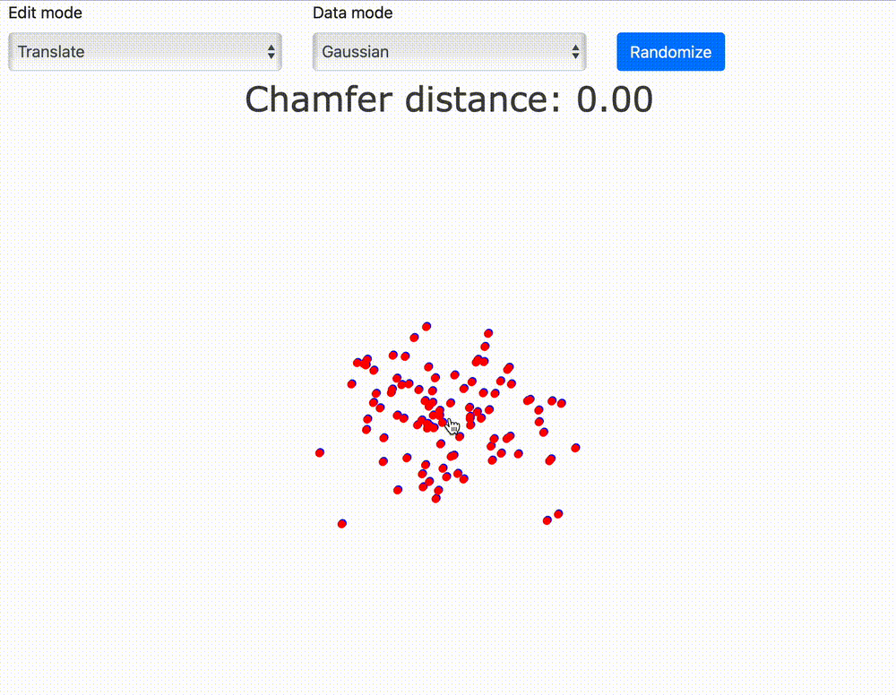
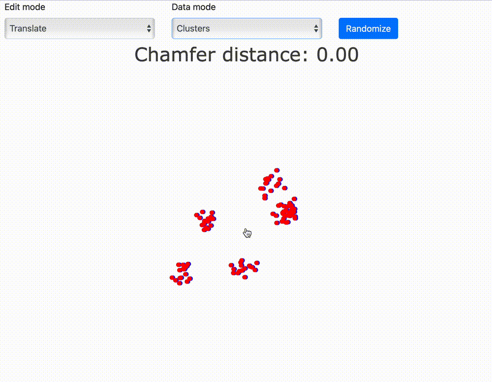
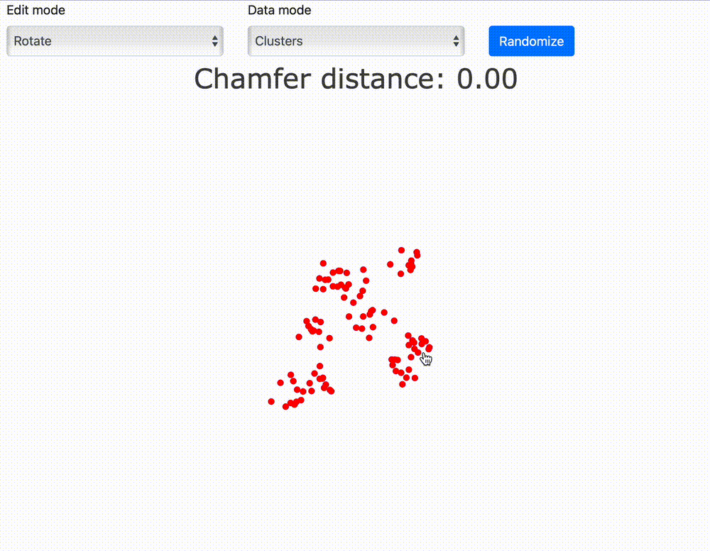

# Chamfer distance visualization

Visualization of the Chamfer distance between two point clouds using `dash` app in **both** Python and Javascript.

[http://www.oliver-ernst.com/chamfer-viz/](http://www.oliver-ernst.com/chamfer-viz/)





## Running

### Javascript

Navigate to the `js` directory and run using VSCode's Live Server extension or any other web server of your choice. For example:

```bash
cd js
python -m http.server
```

### Python

Navigate to the `python` directory and install the requirements:

```bash
pip install -r requirements.txt
```

Then run the app:

```bash
python app.py
```

Optionally: specify the port with `--port` flag or debug mode with `--debug` flag.

## Explanation

1. Given two sets of points or shapes, usually referred to as Set A and Set B.
2. For each point in Set A, find the closest point in Set B and calculate the distance between them.
3. For each point in Set B, find the closest point in Set A and calculate the distance between them.
4. Sum up all these distances from steps 2 and 3 to obtain the Chamfer distance.

Mathematically, the Chamfer distance can be expressed as:

```math
Chamfer distance = Σ(min(dist(A_i, B_j)) + Σ(min(dist(B_i, A_j)))
```

Where:

`A_i` represents a point in Set A.
`B_j` represents a point in Set B.
`dist(A_i, B_j)` is the distance between point `A_i` and its closest point in Set B.
`dist(B_i, A_j)` is the distance between point `B_i` and its closest point in Set A.

## Implementation

Chamfer distance uses a KDTree. A KDTree is a data structure that organizes points in a way that enables fast nearest-neighbor queries. Computing the structure for Set B makes it faster to find the nearest neighbors in Set B for each point in Set A (and vice versa).

The use of the KDTree data structure significantly speeds up the computation of nearest neighbors for each point in Sets A and B. Without KDTree, you would need to perform a brute-force search, which can be computationally expensive, especially for large point sets. KDTree organizes the points in a way that allows for efficient nearest-neighbor queries and is commonly used in computational geometry and various data science tasks.

It's important to note that while KD-Trees offer efficient nearest neighbor and range search capabilities, their performance can degrade for very high-dimensional data (often referred to as the "curse of dimensionality"). In such cases, other data structures like ball trees or approximate nearest neighbor algorithms may be more suitable. Nevertheless, KD-Trees remain a valuable tool for solving a wide range of problems involving multi-dimensional data.

## References

* [KDtree in JS](https://github.com/ubilabs/kd-tree-javascript)

* [Basic Chamfer distance implementation](https://medium.com/@sim30217/chamfer-distance-4207955e8612)

    ```python
    import numpy as np
    from scipy.spatial import KDTree

    def chamfer_distance(A, B):
        """
        Computes the chamfer distance between two sets of points A and B.
        """
        tree = KDTree(B)
        dist_A = tree.query(A)[0]
        tree = KDTree(A)
        dist_B = tree.query(B)[0]
        return np.mean(dist_A) + np.mean(dist_B)
    ```